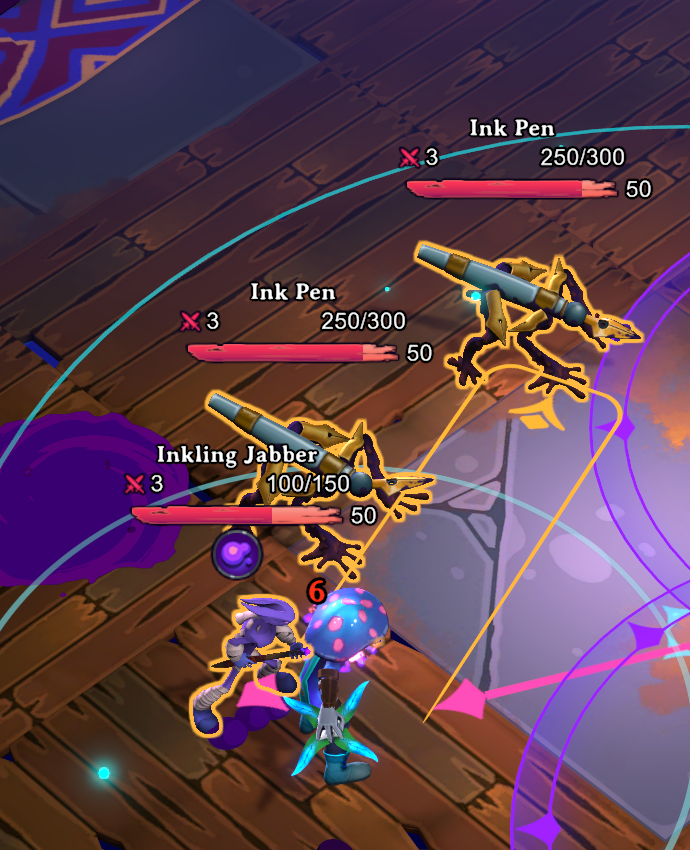
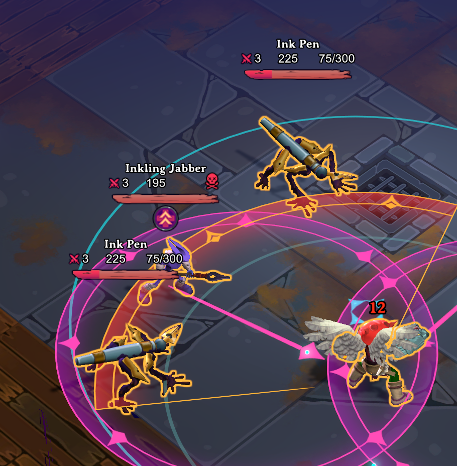

# Projected Damage Plugin

## What does this do?
Shows you a numerical value of the damage you're about to do with your binding either next to the health bar or between incoming dmaage and enemy hp.

## TODO
Find a way to show overkill damage once I can find where the damage is being calculated

## Known Bugs
Shows 0 in green when being healed, working on it.